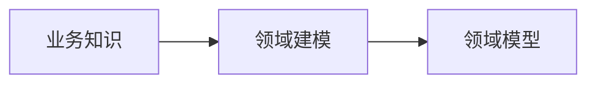

# 概述

领域驱动设计是以业务为核心的软件开发方法论，通过深入理解业务，将业务知识建模为领域模型，最终解决复杂业务场景下的软件开发问题。

- 领域专家：产品/运营/最终用户 一切与软件有利益的关系人员

通过战略设计，将大型复杂的系统拆分为相对简单的子域、上下文、达到化整为0的效果。

# 战略设计

## 上下文

业务之间存在的边界。

限界上下文：定于领域模型的边界

上下文映射：定于位于不同上下文模型的关系和协作方式。常见的方式：共享内核/开放主机服务/防腐层等

## 精炼

核心模型构成核心子域，其余的限界上下文构成非核心子域。

非核心子域划分：

- 支撑子域
- 通用子域

## 模块设计图

# 领域对象的生命周期

# 实体和值对象

实体: 业务知识进行领域建模，在业务上具备连续性与唯一性的一类领域模型，具有唯一标识

值对象：业务领域建模，没有唯一性与连续性，不具备唯一标识，一般为不可变对象。属性要求不可变。

Dp(Domain Primitive): 领域内的基本数据类型，将领域的隐藏概念显示抽取建模成对象。

## 实体的创建

1. 创建过程原子
2.  创建过程所有属性满足业务要求
3. 实体赋予唯一标识

factory创建实体

## 实体的重建

1. 通过Repository完成

## 值对象的创建

创建过程一旦结束不能对属性进行修改或者重新复制，如果需 求，产生新值对象。

1. 通过构造器
2. 通过Factory模式
3. 通过Builder模式

# 聚合与聚合根

- 所有实体都是聚合，单个实体也是聚合
- 聚合是一致性的边界

聚合是一组对象组成，对象形成了对象树。对象树的根对象称为聚合根。

- 聚合根才拥有repository，非聚合根实体不具备Repository

## 聚合设计的原则

1. 设计小而全的聚合
2. 通过唯一标识引用其他聚合根
3. 一个事务只更新单个聚合
4. 跨聚合采用最终一致性

# Factory 

复杂的领域对象采用工厂设计设计思路

- 创建过程是原子性的
- 创建之后的领域对象包含其必要的属性
- 创建完成的对象符合业务规则

主要完成领域对象从无到有的生产，例如创建

# Repository

- 负责聚合根持久化到数据库
- 负责根据聚合根加载领域对象
- 数据库事务控制

# 领域服务

领域中的某个操作涉及多个聚合根，定义独立的接口来完成此项功能，该接口称为领域服务。

特点：

1. 操作无法归属于实体或值对象
2. 根据操作来命名服务
3. 领域服务是无状态的

## 领域服务与应用服务区别

领域服务属于领域层，属于领域模型的一部分。

应用服务属于应用层，负责定义业务用例并协调业务用例的整体流程，同时协调领域层与基础设施层来完成业务操作，不了解业务的具体细节。

# 防腐层

将应用程序内所依赖的外部上下文接口转换成本地上下文定义的领域模型。

实现手段：适配器模式

要点：

1. 封装外部系统技术细节
2. 尽量简单而稳定
3. 入参与出参 均为本地上下文值对象或者基本数据类型
4. 将外部异常转换为本地异常
5. **将外部错误码转换为本地异常**
6. 按需返回
7. 不存在实体或值对象调用防腐层，一般在应用层的应用服务，领域层的领用服务调用防腐层

# 领域事件

## 幂等设计

无论执行多少次相同的操作，结果都保持一致的协议

## 写操作幂等性

1. insert: 唯一性约束
2. update: 不依赖数据历史状态是幂等,反之,不是幂等
   例如`upate t_test set count = count + 1 where id = 1`
3. delete是幂等操作

## 幂等性实现方案

1. 唯一性约束: 唯一性索引,数据库抛出`DuplicateKeyException`
2. 有限状态机

## 领域事件

领域事件是聚合已发生的事实, 代表聚合内**已经发生**的业务操作或状态变化.

- 事件由某个命令操作完成,根据此命令来命令领域事件
- 事件建模成领域对象或贫血对象

### 应用

1. 解耦领域对象之间的关系
2. 触发其他领域对象的行为
3. 记录领域内已发生的状态变化
4. 实现跨聚合的数据一致性
5. 进行限界上下文集成

### 领域事件生成

1. 应用层创建领域事件 **推荐**
2. 聚合根创建领域事件发布,**不推荐**, 因为聚合根做了两件事: 1. 业务操作 2. 发布领域事件, 正常的聚合根方法都是void 基本类型 或者值对象
3. 聚合根根据业务方法返回领域事件,,**不推荐**
4. 聚合根创建领域事件提供抽取领域事件方法,**推荐**
5. 发布领域事件和Repository保持聚合根操作存分布式事务问题

### 领域事件发布

> 避免在分布式事务的前提下可靠地发布领域事件

1. 事件存储
   增加本地事件表，同一个数据库事务保存聚合根，并在本地消息表中保持领域事件。
2. 直接发布并轮询补偿
   1. 应用层调用Repository保存聚合根和领域事件
   2. 应用层直接发布领域事件，发布成功，修改事件存储的状态，此外，提供定时任务，检索超时未发布的
3. 事件日志拖尾
   1. 引用CDC组件（change data capture）捕获数据库日志binlog变更，将其解析后，获得Eventstore 领域事件，进而发布

### 领域事件订阅

1. 收到领域事件（消息）
2. 组装命令对象
3. 调用应用层进行执行

# CQRS

命令查询与责任分离（Command Query Responsibility Segregation）

使用不同的模型，实现修改与查询操作

应用层划分：

- 命令应用服务
- 查询应用服务 

# 战略设计

对领域模型的整体架构和组织进行规划和设计的过程。

1. 限界上下文：对特定的业务内涉及所有相关的概念/规则和流程。
2. 上下文映射：不同限界上下文之间的协作关
3. 划分子域： 某些关联性较强的限界上下文组成更大的业务概念，称为子域。 例如：商品&订单&用户形成电商子域。

## 限界上下文

特定的业务范围内的所有 概念。流程和规 则等。

1. 定义业务边界
2. 确定领域模型的生效范围
3. 治理业务复杂性

## 上下文映射

对限界上下文协作关系的描述

1. 共享内核
2. 客户/供应商
3. 跟随者
4. 各行其道
5. 开放主机服务
6. 发布语言

##  子域

定义： 整体业务领域中一个相对完整的子业务。

### 类型

#### 核心子域

业务系统中最重要，最核心的部分，包含最关键的业务规则，业务数据，业务流程。

#### 支撑子域

在业务领域中负责支撑角色的子域。

#### 通用子域

多个业务领域中通用概念或者通用业务流程。例如：认证子域，通知子域

> 子域的划分处于动态平衡中

### 子域演变

