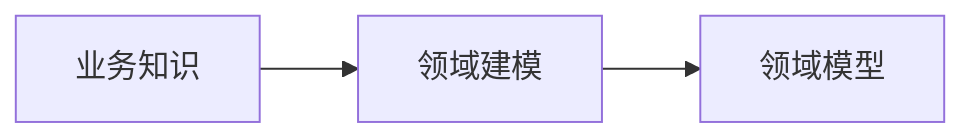

# 概述

领域驱动设计是以业务为核心的软件开发方法论，通过深入理解业务，将业务知识建模为领域模型，最终解决复杂业务场景下的软件开发问题。

- 领域专家：产品/运营/最终用户 一切与软件有利益的关系人员

通过战略设计，将大型复杂的系统拆分为相对简单的子域、上下文、达到化整为0的效果。

# 战略设计

## 上下文

业务之间存在的边界。

限界上下文：定于领域模型的边界

上下文映射：定于位于不同上下文模型的关系和协作方式。常见的方式：共享内核/开放主机服务/防腐层等

## 精炼

核心模型构成核心子域，其余的限界上下文构成非核心子域。

非核心子域划分：

- 支撑子域
- 通用子域

## 概览图

# 领域对象的生命周期

# 实体和值对象

实体: 业务知识进行领域建模，在业务上具备连续性与唯一性的一类领域模型，具有唯一标识

值对象：业务领域建模，没有唯一性与连续性，不具备唯一标识，一般为不可变对象。属性要求不可变。

Dp(Domain Primitive): 领域内的基本数据类型，将领域的隐藏概念显示抽取建模成对象。

## 实体的创建

1. 创建过程原子
2.  创建过程所有属性满足业务要求
3. 实体赋予唯一标识

factory创建实体

## 实体的重建

1. 通过Repository完成

## 值对象的创建

创建过程一旦结束不能对属性进行修改或者重新复制，如果需 求，产生新值对象。

1. 通过构造器
2. 通过Factory模式
3. 通过Builder模式

